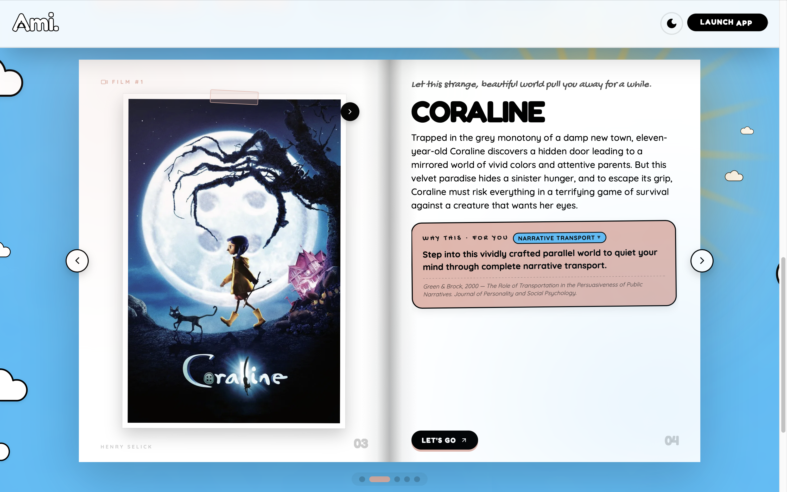

# Ami or the end of doomscrolling

**Recommendation based on preferences can trap us in our own biases (Nguyen et al., 2014). Recommendation based on research could liberate us. That is Ami's principle.**

Ami recommends films, series, novels, and cultural anecdotes based on how you feel *right now* and on peer-reviewed psychological research, not on your watch history nor on a popularity algorithm.

[](https://www.youtube.com/watch?v=VSvpd5PVpmU)
[](LICENSE) [](https://huggingface.co/spaces/aichakorovaev/ami-demo/tree/main).

Deployed publicly on Hugging face since May 18 2026 


**[→ Try the live demo](https://aichakorovaev-ami-demo.hf.space)**

---

## Table of Contents

- [What Ami Does](#what-ami-does)
- [The Problem](#the-problem)
- [The Impact Ami Can Have](#the-impact-ami-can-have)
- [Why Gemma 4](#why-gemma-4)
- [Architecture](#architecture)
- [The Catalogue](#the-catalogue)
- [Psychological Mechanisms](#psychological-mechanisms)
- [What Ami Is Not](#what-ami-is-not)
- [Engineering Deep Dive](#engineering-deep-dive)
- [Technical Stack](#technical-stack)
- [Project Structure](#project-structure)
- [Getting Started](#getting-started)
- [API](#api)
- [Limitations and Next Steps](#limitations-and-next-steps)
- [Credits](#credits)
- [License](#license)

---

## What Ami Does

You describe your emotional state in your own words (text or audio) or with an image, a meme (yes, a meme!), a screenshot of a tweet, or whatever image helps describe how you feel. You then provide your birth year. Ami returns four carefully chosen items, each with a personal explanation grounded in a specific psychological mechanism.

The experience takes a few seconds, set in a cheerful, well-thought-out sky design where words float and react.

There is no account needed, no history, and no tracking. Each session is forgotten when the app is closed.

## The Problem

The filter bubble is a well-documented phenomenon that can lead to radicalisation and more. Efforts to combat it have been underway since awareness of the issue first emerged in the early 2010s with Eli Pariser's book and TED talk. The main challenge is that forcibly "popping" someone's bubble by exposing them to opposing viewpoints often backfires (Bail et al., 2018).

Meanwhile, most well-being apps either tell people what to do (meditate, journal, exercise) or recommend content based on what they already like — which can lead right back to the bubble.

The psychology literature points to something more nuanced: the right story, read or watched in the right emotional state, can trigger measurable changes in well-being through specific psychological mechanisms. A grieving person may benefit more from a devastating film than a cheerful one.

These mechanisms are documented. They are rarely used in consumer applications. They could spark curiosity.

## The Impact Ami Can Have

Ami combines science and art, using research papers to relieve you through a different approach. This can naturally lead to the realisation that what helps you feel better can lie *outside* the bubble, sparking curiosity beyond it and helping to pop it. Along the way, Ami also helps you to:

- **Better understand your feelings**, share them as raw and unclear as you like, in text, audio, or image; Ami will find the right words.
- **Watch, read, and talk about stories differently**, by focusing on the underlying mechanism, and having fun spotting other mechanisms present in the work.
- **Learn more about psychology.**

The goal: a world where we scroll less, in order to look more at the sky and its endless possibilities.

## Why Gemma 4

Ami's core insight requires a model that can do three things well:

1. **Decode** emotionally complex natural language from text, emoji, audio-converted-to-text, or image (multimodality) with psychological precision.
2. **Reason** across a structured catalogue to make non-obvious connections while guaranteeing confidentiality and data privacy, thanks to its open-source nature.
3. **Return** a correctly formatted JSON output.

**Gemma 4 31B-IT** handles all three in a single model, running entirely on a Kaggle T4 GPU with no external API call, the engineering behind that on-device deployment (4-bit quantization, a custom vision fix, native function calling) is documented in [Engineering Deep Dive](#engineering-deep-dive). For the live demo (Google AI Studio API + Hugging Face), the model's popularity meant we used **Gemma 4 26B-A4B-IT** instead.

## Architecture

The challenge is making recommendations that are both **relevant** and **diverse**. LLMs themselves tend to get trapped by the filter bubble, Gemma included, but they excel at natural-language comprehension. So Ami uses what Gemma is best at to fight the very bias LLMs share with us.

Ami runs a three-stage pipeline, powered throughout by the same Gemma instance  (26B-A4B-IT).

**Stage 1 : Gemma as "Psychologist"**
Receives the user's entry : text, mood buttons, birth year, and optionally an image or audio-derived text then identifies the right primary and secondary mechanisms, checks whether nostalgia is relevant, and whether a surprising or humorous recommendation would be appropriate, converting vague, emotionally rich natural language into a structured profile that drives precise catalogue filtering. When an image is involved, vision and emotional decoding happen in a single fused multimodal call rather than two chained ones (see [Engineering Deep Dive](#engineering-deep-dive)). Returns a structured psychological profile in JSON: `emotion_core`, `primary_mechanism`, `secondary_mechanism`, `active_moods`, etc.


**Stage 2 : Pre-filtering & Diversification**
The catalogue is pre-filtered in Python from 300+ items down to 15, using a scoring system that ensures the primary mechanism, secondary mechanism, and active moods are all represented. Gaussian noise (σ = 1.5) is then added for diversity, without it, the top results would be identical for every query sharing the same profile.

**Stage 3 : Gemma as "Librarian"**
Selects four works and, for each, writes a `personal_intro` (a short hook, max 12 words) shown just before the recommendation, plus a **thesis**: 2–3 compassionate sentences framing the picks within the mechanism's underlying science. Two implementations exist : a classic JSON-prompting mode, and an agentic mode using Gemma 4's native function calling (see [Engineering Deep Dive](#engineering-deep-dive)).


## The Catalogue

Built separately by :

- Fetching films and series from **TMDB** (rating ≥ 7/10, ≥ 300 votes, all genres including Horror, which triggers `benign_masochism`) with full metadata (director, keywords, country of origin…), ranked and cut to the top 150.
- Fetching 50 selected novels from **Open Library**, with opening sentences and subject tags.
- Scraping **Wikipedia** for impactful anecdotes.
- Running Gemma 4 on each item (excluding anecdotes) to assign: psychological mechanism, mood tags, rationale, surprise factor (1–3), emotional intensity, sensory signature, and nostalgia decade.
- Running Gemma 4 on each Wikipedia event to rewrite it as a warm, personal account ending in an engaging question — and on each overview, to make the underlying mechanism stand out more clearly.

**Result:** 150 films, 100 series, 50 novels, and 148 anecdotes.

## Psychological Mechanisms

Ami's recommendations are grounded in eleven validated mechanisms from the psychological literature. Each mechanism in the catalogue is tied to a specific published paper. A few examples:

| Mechanism | Paper | What It Does |
|---|---|---|
| **Benign Masochism** | Hanich et al., 2014 — *Psychology of Aesthetics* | Experiencing intense negative emotions through fiction is cathartic, because the brain registers the safety of the fictional frame. |
| **Awe** | Stellar et al., 2015 — *Emotion* | Exposure to vastness shrinks self-focused anxiety and expands perceived time. |
| **Nostalgia** | Sedikides & Wildschut, 2018 — *Review of General Psychology* | Nostalgic recall increases self-continuity, social connectedness, and meaning. |

*The full list of eleven mechanisms is documented in the app.*

`benign_masochism` deserves particular mention: it produces the most counter-intuitive recommendations, a horror film for someone angry, a devastating novel for someone grieving, and is the clearest demonstration of Ami's departure from conventional content recommendation.

## What Ami Is Not

Ami does not assess mental health, does not provide clinical advice, and is not a substitute for professional support. A 3-tier crisis classifier, regex fast-path then Gemma-as-judge for ambiguous cases, checks every input and responds immediately with crisis resources when needed (see [Engineering Deep Dive](#engineering-deep-dive)).

## Engineering Deep Dive
 
Before the live demo moved to the Google AI Studio API, Ami ran **fully on-device**: a single Gemma 4 31B-IT instance, 4-bit quantized, served every stage of the pipeline (Psychologist, Librarian, safety judge) on one Kaggle T4 GPU (16GB VRAM), with no external API call. The full notebook lives in [`/notebooks`](./notebooks); this section documents the engineering it took to get a 31B multimodal model running reliably on a single consumer-grade GPU.
 
### Quantization, and the vision bug it introduces
 
- 4-bit NF4 quantization via `bitsandbytes` (`BitsAndBytesConfig(load_in_4bit=True, bnb_4bit_quant_type="nf4", bnb_4bit_use_double_quant=True, bnb_4bit_compute_dtype=torch.bfloat16)`) brings the 31B model from ~54GB down to ~8GB of VRAM : the difference between "doesn't fit" and "fits comfortably on a T4."
- 4-bit quantization silently breaks Gemma 4's **vision branch**: `embed_vision`, the linear bridge between visual tokens and the LLM's hidden space, gets quantized along with everything else and produces vision features the language model reads as flat gray. The model loads without error and looks fine on text, it's just blind.
- **The fix**: a recursive module walk finds every `Linear4bit` layer inside `vision_tower` and `embed_vision`, dequantizes it back to bf16 in place (`bitsandbytes.functional.dequantize_4bit`), and swaps it for a standard `nn.Linear` for about +600MB of VRAM. The fix is verified immediately after: a canonical test image (the Hugging Face "bee" demo photo) is sent through the real inference path, and the response is checked for the word "bee" before the pipeline is allowed to continue.
  
### One model, two "senses" and one call
 
- `AutoModelForImageTextToText` loads a single set of weights that serves both text-only and image+text prompts through the same `.generate()` call, the whole pipeline (Psychologist, Librarian, safety judge) shares one loaded model.
- When an image is provided (a meme, a screenshot, a photo, a quote card), the Psychologist reads image and text **together in a single multimodal call**, instead of chaining a separate "vision captioning" pass into a second "emotion decoding" pass. The prompt itself teaches the model to read different image types differently, a meme's *irony* is the signal, a quote's *meaning* is the signal, a photo's *lighting and absence* is the signal; rather than treating every image as a generic captioning task.
  
### Two Librarian implementations
 
- **Classic mode**: the 300+ item catalogue is pre-filtered in Python (not by the LLM) down to 15 candidates using a weighted score (mechanism match, mood overlap, decade, an anti-repetition cooldown from recent sessions) plus Gaussian jitter, then sampled stochastically rather than taken as a strict top-N, so two requests with an identical psychological profile don't return the exact same four items. A quota system guarantees at least one anecdote makes the pool when the Psychologist flags it as relevant, and results are balanced by content type (film/series/novel/anecdote).
- **Agentic mode**: Gemma 4's native function calling (`tokenizer.apply_chat_template(tools=...)`, `tokenizer.parse_response()`), with four tools : `search_catalogue`, `get_research_paper`, `score_item_for_user`, `finalize_recommendations` and a strict 5-turn budget. Guardrails include a search-call cap, a forced "finalize now" nudge on the last turn, a fallback that synthesizes an answer from whatever candidates were found if the model never calls `finalize_recommendations`, and a full trace of every tool call for debugging. This is the version referenced in [Limitations](#limitations-and-next-steps). It worked, but roughly doubled response time, which is why the shipped demo defaults to the classic mode.
  
### Safety layer: 3 tiers, fail conservative
 
- **Tier 1 : regex, crisis**: ~25 patterns catching explicit suicidal ideation, self-harm, and intent to harm others; on a match, generation stops immediately, no model call needed.
- **Tier 2 : regex, high distress**: ~14 patterns (hopelessness, recent bereavement, "can't go on") combined with a check on selected mood buttons.
- **Tier 3 : Gemma-as-judge**: for anything ambiguous, a dedicated low-temperature (0.2) Gemma call classifies the input, explicitly instructed to be conservative, "when in doubt between crisis and high_distress, choose crisis." If the judge call fails or returns malformed JSON, the classifier falls back to the regex signal rather than defaulting to "normal."
- A "crisis" verdict short-circuits the whole pipeline: it returns region-specific hotlines (3114 in France, 988 in the US, Samaritans in the UK, findahelpline.com internationally) instead of recommendations, while still offering a gentle opt-in to continue. A "high_distress" verdict doesn't block anything, it just switches the Librarian's tone to `tender` (no humor, no surprise, no high-intensity picks).
  
### Serving it without it falling over
 
- The `/api/recommend` endpoint streams via **Server-Sent Events** rather than returning one blocking JSON response, with `X-Accel-Buffering: no` so intermediate proxies (ngrok included) don't buffer the stream.
- The Librarian call (the slowest step) runs in a background thread while the main request loop sends a heartbeat event every 15 seconds, so long generations don't trip a client or proxy timeout.
- VRAM is freed explicitly between Gemma calls (`gc.collect()`, `torch.cuda.empty_cache()`, `torch.cuda.synchronize()`), and the agentic tool loop specifically catches `torch.cuda.OutOfMemoryError` rather than letting a single bad turn kill the whole request.
  
### Fallbacks, at every layer
 
Robustness wasn't bolted on at the end. Nearly every function has a defined failure mode: the model path falls back to a lighter Gemma 4 variant if the primary weights aren't found, a malformed JSON response from the Psychologist falls back to a heuristic profile built from the selected mood buttons, an unknown psychological mechanism falls back to a fuzzy string match before giving up, and the agentic Librarian falls back to synthesizing an answer from partial results rather than returning nothing.
 
## Technical Stack
 
| Component | Live Demo (Hugging Face Space) | Original Prototype ([`/notebooks`](./notebooks)) |
|---|---|---|
| Language model | Gemma 4 26B-A4B-IT via Google AI Studio API | Gemma 4 31B-IT, 4-bit NF4 (bitsandbytes, double quant), fully on-device |
| Inference | Hugging Face Transformers (bleeding-edge from source) | Same, plus a custom vision-branch dequantization patch (see [Engineering Deep Dive](#engineering-deep-dive)) |
| Compute | Remote API call, no local GPU needed | Kaggle T4 (16GB VRAM) |
| Librarian | Classic JSON-prompting mode | Classic mode **and** an agentic mode with native Gemma 4 function calling (4 tools) |
| Backend | Flask + Flask-CORS, streamed via Server-Sent Events | Same, plus a threaded heartbeat to survive long generations behind an ngrok tunnel |
| Frontend | React 18 (UMD) + Babel standalone + Lucide React | React 18 via `esm.sh` with an import map (single shared React instance), Babel standalone, Framer Motion, Recharts |
| Voice input | Browser-native Web Speech API | Same |
| Hosting / tunnel | Hugging Face Spaces (Docker) | ngrok (auth token managed as a Kaggle secret) |
| Film/series data | TMDB API | Same |
| Book data | Open Library API | Same |
| Anecdote source | Wikipedia | Same |
| Catalogue | 300+ items across 11 psychological mechanisms | Same |
| Safety | 3-tier crisis classifier : regex fast-path, then Gemma-as-judge for ambiguous cases, fail-conservative | Same |
 

## Project Structure

```
Ami-app/
├── app.py                        # Flask backend: Gemma pipeline (Psychologist → filter → Librarian), SSE streaming
├── index.html                    # Single-file React (UMD) frontend
├── requirements.txt              # Python dependencies
├── Dockerfile                    # Hugging Face Spaces (Docker) deployment, port 7860
├── .gitattributes                # Git LFS rules (Hugging Face Spaces defaults)
├── data/
│   ├── ami_catalogue.json        # Raw catalogue (films, series, novels)
│   ├── ami_catalogue_updated.json# Enriched catalogue used at runtime
│   └── ami_anecdotes.json        # Wikipedia-derived anecdotes
├── static/
│   └── mood-1.webp … mood-5.webp # Mood illustrations used by the frontend
└── notebooks/
    └── Gemma-4-is-Ami.ipynb      # Original on-device prototype: Gemma 4 31B-IT, 4-bit, classic + agentic Librarian, 3-tier safety layer, Flask + ngrok : see Engineering Deep Dive
```

## Getting Started

### Prerequisites

- Python 3.11+
- A [Google AI Studio](https://aistudio.google.com/) API key (for the `gemma-4-26b-a4b-it` demo backend)

### Local setup

```bash
git clone https://github.com/<your-username>/ami-app.git
cd ami-app

python -m venv venv
source venv/bin/activate        # Windows: venv\Scripts\activate

pip install -r requirements.txt

export GOOGLE_AI_STUDIO_KEY="your-api-key-here"   # Windows: set GOOGLE_AI_STUDIO_KEY=...

python app.py
```

The app serves on **http://localhost:7860**.

### Running with Docker (as on Hugging Face Spaces)

```bash
docker build -t ami-app .
docker run -p 7860:7860 -e GOOGLE_AI_STUDIO_KEY="your-api-key-here" ami-app
```

> **Note:** the repository ships `Dockerfile` and `.gitattributes` — if you downloaded a `Dockerfile.txt` / `gitattributes.txt` export, rename them (drop the `.txt` extension) before deploying to Hugging Face Spaces.

### Running the original on-device prototype (Kaggle)

The notebook in [`/notebooks`](./notebooks) runs the entire pipeline : Psychologist, Librarian (classic or agentic), and the 3-tier safety layer on a single Gemma 4 31B-IT instance, 4-bit quantized, with no external API call (see [Engineering Deep Dive](#engineering-deep-dive)):

1. Open the notebook on Kaggle and enable **GPU T4** in the notebook settings.
2. Enable **Internet** access.
3. Add your ngrok auth token as a Kaggle secret named `NGROK_TOKEN`.
4. Run All → model loading takes about 13–15 minutes.
5. The public ngrok URL is printed by the last cell.

## API

| Endpoint | Method | Description |
|---|---|---|
| `/` | GET | Serves the frontend (`index.html`) |
| `/api/health` | GET | Health check, returns the active model name |
| `/api/recommend` | POST | Runs the Psychologist → filter → Librarian pipeline, streamed as **Server-Sent Events** |

**Request body** for `/api/recommend` (JSON):

```json
{
  "free_text": "string, optional",
  "selected_moods": ["array of strings, optional"],
  "birth_year": "number, optional",
  "image_b64": "base64 data URI, optional",
  "continue_anyway": "boolean, optional — bypass a crisis-safety pause",
  "nonce": "string, optional"
}
```

At least one of `free_text`, `selected_moods`, or `image_b64` is required.

**SSE event stream:** `status` → (`vision_insight`) → (`crisis`) → `item` × 4 → `done`, or `error` on failure.

## Limitations and Next Steps

- Enough tests to ensure that the recommendations are always age and tone appropriate and nothing else unsafe to signal.
- An agentic version was tried (see [Engineering Deep Dive](#engineering-deep-dive)). It worked well but roughly doubled response time, which is why the shipped demo defaults to the classic mode.
- The app is currently English-only. It could be extended to more languages and to more items from different countries, for a more diverse catalogue.
- A larger catalogue to ensure sufficient coverage for every mechanism and mood as well as more diverse recommendations.
- Future ideas include adding paintings, souvenirs, and more.

> If you encounter the instable awe ether, please try again, the AI API can be unstable, but it works!

## Credits

Ami was built for the **Gemma 4 Good Hackathon** (Kaggle × Google DeepMind, 2026).

All psychological mechanisms are tied to peer-reviewed publications. The application does not provide clinical advice.

## License

This project is licensed under the [MIT License](LICENSE) - see the `LICENSE` file for details.

---

*Don't miss your ticklish bubble burster.* 
